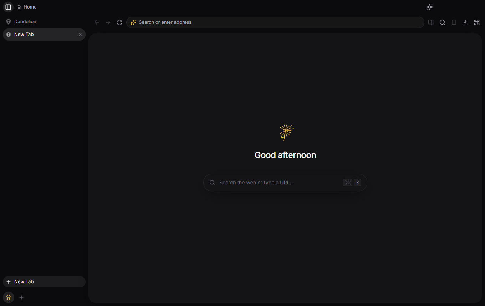
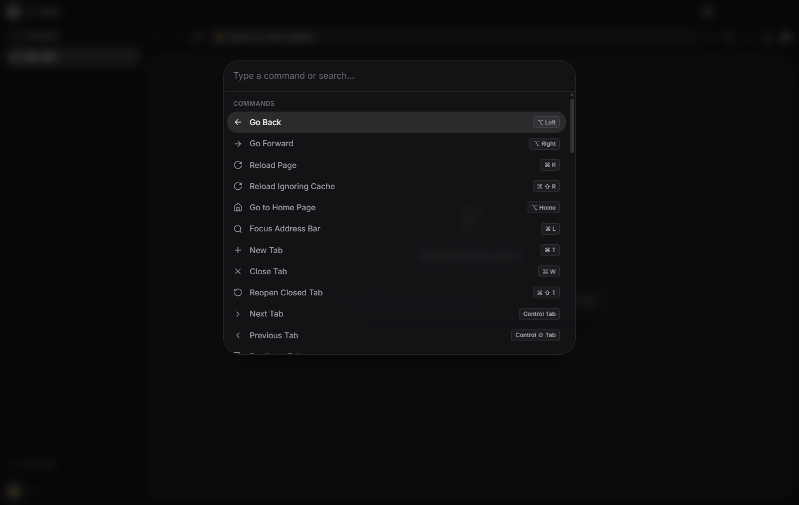
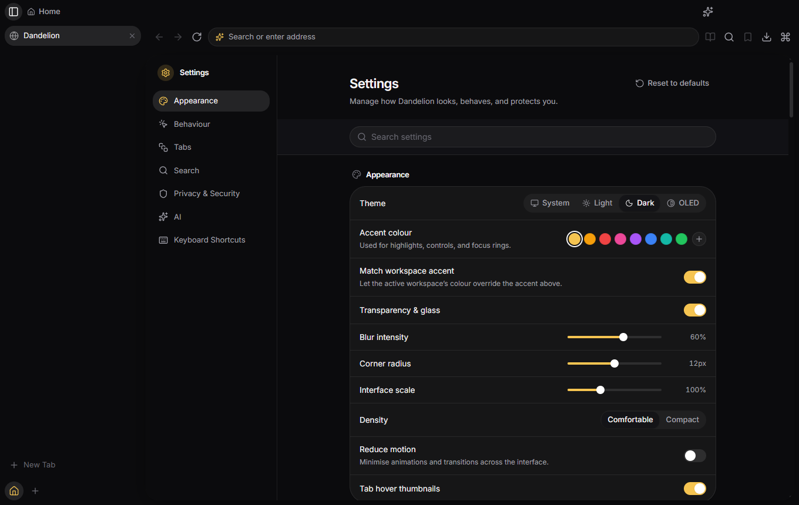
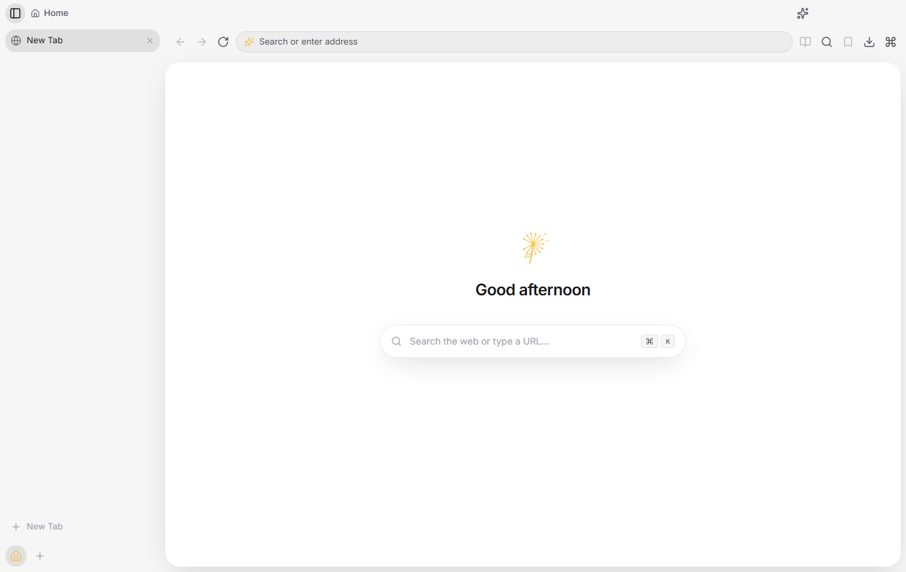

<div align="center">

# 🌼 Dandelion

**A fast, private, beautiful desktop web browser.**

Workspaces · split view · a Raycast-style command palette · a local-first privacy engine ·
an encrypted password vault · a pluggable AI assistant

[](LICENSE)
[](https://www.electronjs.org/)
[](https://react.dev/)
[](https://www.typescriptlang.org/)
[](tests/)



</div>

---

> **Status: working developer preview.** The browser boots, renders pages in isolated
> `WebContentsView` tabs, blocks trackers, and drives every feature through a fully-typed
> tRPC-over-IPC bridge. It is not yet packaged for general use — see [Known limits](#known-limits).

## Why Dandelion

Most Electron "browsers" are a web view in a window. Dandelion is built like an actual browser: the
React app renders **only the chrome**, and every tab is a separate `WebContentsView` with its own
process and session partition. That boundary is what makes tab sleeping, split view, per-site
permissions and profile isolation real rather than cosmetic.

## Features

|                         |                                                                                                                           |
| ----------------------- | ------------------------------------------------------------------------------------------------------------------------- |
| **Real architecture**   | Each tab is an isolated `WebContentsView` — own process, own session, sandboxed, context-isolated.                        |
| **Workspaces**          | Arc-style spaces for grouping tabs, layered on profiles — the true storage boundary (cookies, passwords, permissions).    |
| **Tabs, done properly** | Vertical or horizontal. Pinned, sleeping, grouped, drag-reordered, muteable, with previews and recently-closed restore.   |
| **Omnibox**             | URLs, search, history, bookmarks, tab switching, an offline calculator and unit converter, with inline autocomplete.      |
| **Command palette**     | `⌘K` / `Ctrl+K` — every command and open tab, fuzzy-searchable.                                                           |
| **Privacy engine**      | Request-level ad/tracker/fingerprinter blocking, HTTPS upgrades, DNT/GPC headers, per-tab shield report.                  |
| **Encrypted vault**     | AES-256-GCM credentials under a scrypt-stretched master password. Keys never touch disk in plaintext.                     |
| **AI assistant**        | Bring-your-own-key providers (OpenAI · Anthropic · Google · local) with streaming chat and page actions. No keys shipped. |
| **Everything else**     | Downloads with pause/resume, searchable settings, history timeline, cookie manager, MV3 extensions, secure DNS.           |

## Screenshots

<div align="center">



<em>The command palette — every command and open tab, one fuzzy search away.</em>

<br><br>



<em>Settings — searchable, with System / Light / Dark / OLED themes and a live accent.</em>

<br><br>



<em>Light theme. Dandelion follows your system by default.</em>

</div>

## Quick start

```bash
npm install          # install dependencies
npm run rebuild      # rebuild better-sqlite3 for Electron's ABI (once, after install)
npm run dev          # launch the browser with hot reload
```

Requires **Node 20+**.

> **Sandbox note:** some CI/sandbox environments export `ELECTRON_RUN_AS_NODE=1`, which turns
> Electron into a plain Node runtime (no window). If the app doesn't open, launch with
> `env -u ELECTRON_RUN_AS_NODE npm run dev`. A normal desktop is unaffected.

### Scripts

| Script                    | Description                                          |
| ------------------------- | ---------------------------------------------------- |
| `npm run dev`             | Launch with hot-reloading main, preload and renderer |
| `npm run build`           | Type-safe production bundle (`out/`)                 |
| `npm run rebuild`         | Rebuild native modules against Electron              |
| `npm run typecheck`       | Type-check the Node and Web projects                 |
| `npm run lint` / `format` | ESLint / Prettier                                    |
| `npm test`                | Vitest unit + component tests                        |
| `npm run test:e2e`        | Playwright end-to-end (builds first)                 |
| `npm run dist`            | Package installers with electron-builder             |

## Architecture at a glance

```text
┌─────────────────────────────────────────────────────────────────┐
│ MAIN PROCESS (Node) — the "browser process"                      │
│  AppContext (DI) · WindowManager · TabManager (WebContentsView)  │
│  SessionManager · SQLite + repositories · services · tRPC host   │
└───────────────┬────────────────────────────┬────────────────────┘
     contextBridge (preload)           attaches N views
   ┌────────────▼───────────┐   ┌────────────▼─────────────────┐
   │ RENDERER (React chrome)│   │ WebContentsView per tab       │
   │ titlebar·tabs·omnibox  │   │ (isolated, sandboxed, own     │
   │ sidebar·palette·pages  │   │  session partition)           │
   └────────────────────────┘   └──────────────────────────────┘
```

Communication is a fully-typed **tRPC-over-Electron-IPC** bridge (a custom link — no fragile
third-party adapter) plus a typed event channel for main → renderer push.

See [`docs/ARCHITECTURE.md`](docs/ARCHITECTURE.md) for the deep dive, and
[`docs/PROJECT_STRUCTURE.md`](docs/PROJECT_STRUCTURE.md) for a folder-by-folder tour.

## Tech stack

Electron 43 · React 19 · TypeScript 5.9 · Vite 7 / electron-vite · Tailwind CSS v4 · Motion ·
Zustand 5 · tRPC 11 · Zod 4 · better-sqlite3 · Vitest 4 · Playwright · ESLint · Prettier.

## Security model

- Context isolation and sandbox on for both the chrome and every web tab.
- The chrome window cannot navigate to external content or open OS windows.
- Per-profile Electron session partitions isolate cookies, cache and storage.
- Passwords are sealed with AES-256-GCM under a scrypt-derived key; the data key exists in memory
  only while unlocked and is zeroed on lock.
- API keys are encrypted with the OS keychain via Electron `safeStorage`.

## Known limits

Dandelion is honest about what it isn't yet:

- **Google sign-in does not work.** Google refuses to authenticate inside Chromium-embedding
  applications, and classifies Dandelion as one. This affects every Electron-based browser, and
  switching engines would not fix it — Electron already ships real Chromium, and Google's own error
  page names other real-Chromium embedders too.
- Sync is local-only; there is no sync backend yet.
- The AI assistant needs your own API key — none ship with the app.
- See [Work/BUGS.md](Work/BUGS.md) for known defects, and [Work/TODO.md](Work/TODO.md) for planned
  work.

## Documentation

- [Architecture](docs/ARCHITECTURE.md) — process model, entity model, every subsystem
- [Developer guide](docs/DEVELOPER.md) — setup, workflows, adding features, debugging
- [Project structure](docs/PROJECT_STRUCTURE.md) — what lives where and why
- [Contributing](CONTRIBUTING.md) — conventions and the review checklist

## Contributing

Issues and pull requests are welcome. Read [CONTRIBUTING.md](CONTRIBUTING.md) first — it covers the
branch-first workflow, commit conventions and the review checklist the project holds itself to.

## License

Dandelion is free software: you may use, study, share and modify it under the terms of the
**GNU General Public License v3.0 or later**. Derivatives must remain under the same license, so
the browser and its forks stay open. See [LICENSE](LICENSE) for the full text.

Copyright © 2026 Christian Relf.
